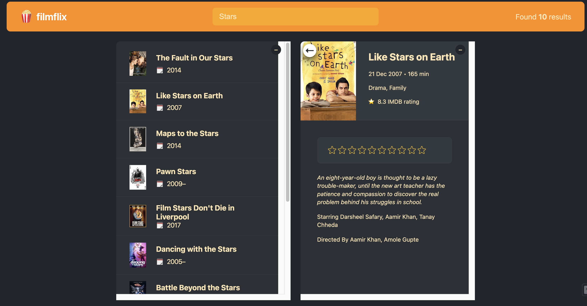

# FilmFlex - Movie Search and Watchlist App

FilmFlex is a movie search and watchlist web application that allows users to search for movies and add them to their watchlist. Users can view movie details, mark movies as watched, and manage their watched movie list.



## Table of Contents

- [Demo](#demo)
- [Features](#features)
- [Getting Started](#getting-started)
  - [Prerequisites](#prerequisites)
  - [Installation](#installation)
  - [Running the App](#running-the-app)
- [Usage](#usage)
- [Technical Details](#technical-details)
- [Dependencies](#dependencies)


## Demo

[Live Demo](https://www.example.com) - [Insert link to a live demo of the application if available]

## Features

- **Movie Search:** Users can enter a movie title in the search bar to find movies that match the search query. The app uses the Open Movie Database (OMDb) API to fetch movie details.

- **Search Results:** The search results are displayed in a list format, showing movie posters, titles, and release years. Users can click on a movie to view its details.

- **Movie Details:** When a user clicks on a movie from the search results, a modal window displays detailed information about the selected movie. Users can add the movie to their watchlist from here.

- **Watchlist Summary:** On the right side of the page, the app shows a summary of the movies added to the user's watchlist. It displays the total number of movies watched.

- **Watched Movies List:** Below the watchlist summary, the app shows the list of watched movies. Users can remove movies from the watchlist by clicking the delete icon.

## Getting Started

### Prerequisites

Before running the application, make sure you have the following prerequisites installed:

- Node.js (>=12.0.0)
- npm (Node Package Manager)

### Installation

1. Clone the repository to your local machine:

```bash
git clone https://github.com/yourusername/filmflex.git
cd filmflex
```

2. Install the dependencies:

```bash
yarn install
```

### Running the App

To start the development server and run the app locally, use the following command:

```bash
yarn dev
```

Open your web browser and go to `http://localhost:5173` to access the app.

## Usage

1. **Movie Search:**
   - Enter the title of the movie you want to search for in the search bar.
   - The app will display a list of movies matching the search query.
   - Click on a movie from the search results to view its details.

2. **Movie Details:**
   - When you click on a movie from the search results, a modal window will appear with detailed information about the selected movie.
   - You can add the movie to your watchlist by clicking the "Add to Watchlist" button.

3. **Watchlist:**
   - On the right side of the page, you'll see the watchlist summary, showing the total number of movies watched.
   - Below the watchlist summary, you'll find the list of watched movies.
   - To remove a movie from the watchlist, click the delete icon next to the movie.

## Technical Details

- The app is built using React, a popular JavaScript library for building user interfaces.
- It uses React hooks, such as `useState` and `useEffect`, for managing state and performing side effects.
- The movie data is fetched from the Open Movie Database (OMDb) API using the `fetch` API and asynchronous functions.
- The app components are organized into separate files in the `components` folder for better code structure and reusability.
- The app uses CSS styling to provide a visually appealing user interface. The main styling file is `index.css`.
- The project is bundled using Vite, a fast and flexible build tool.
- The app follows modern JavaScript syntax, including arrow functions, object destructuring, and async/await.

## Dependencies

- React (library for building user interfaces)
- Vite (build tool)
- CSS (styling)
- Open Movie Database (OMDb) API (for movie data)


